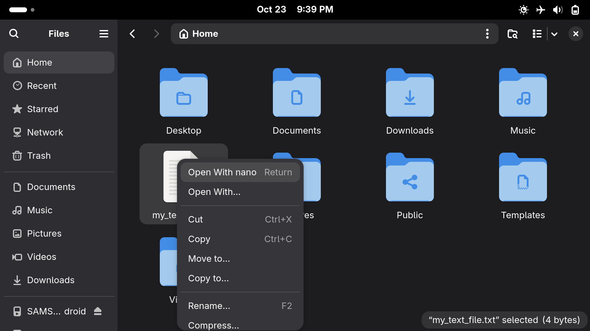
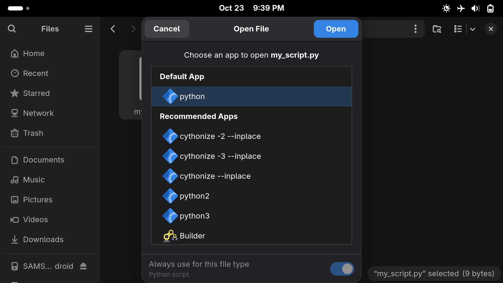
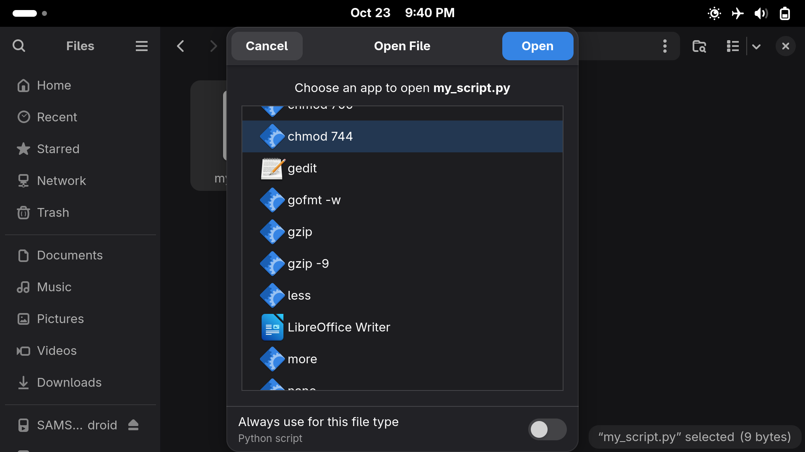

This repo contains a set of configuation files that can be used on Linux-based systems to create desktop shortcuts for existing command line tools (e.g., `chmod`, `nano`) and thus make them launchable from a desktop environment (by creating desktop entries for them). It mostly follows <https://specifications.freedesktop.org/desktop-entry-spec/latest/>.

It currently wraps the following tools:

* `chmod`

* `ed`, `emacs`, `nano`, `vi`

* `more`, `less`, `touch`

* Compression tools, such as `gzip` or `xz`. This enables you to use compression-only formats directly from GUI.

* Certain interpreters for scripting languages.

* Certain compilers.

### Screenshots







### Background

The background of starting this project was that I found certain basic GUI applications on Linux-based systems were harder to use than CLI programs; they were obviously not designed for people who do coding or system administration and would cause actual issues when people of these two categories try to use them; on the other hand, CLI programs on modern Linux distros are relatively mature, stable and efficient, but harder to launch from GUI.

### Installing the shortcuts

The shortcuts should be placed in `~/.local/share/applications`, while the custom MIME type definitions should be placed in `~/.local/share/mime/packages`, and you will need to update the database of the system; this repo provides a helpful script to do that for you.

* To install all shortcuts:

    ```sh
    # Note that you normally don't need to install all shortcuts unless you also installed exactly the same softwares as I do.
    cd cli-desktop-entries
    bash install.sh all
    ```

* To only install shortcuts and MIME types that mention "python":

    ```sh
    # This will copy all configuation files whose names contain `python` into the local application and MIME-type-definition directories.
    cd cli-desktop-entries
    bash install.sh python
    ```

Note that this only installs the desktop shortcut but not the command or program. You still need to install the actual package or software that provides such command (and add it to your `PATH` environment variable) so that you will have something to launch, and if it isn't installed, the shortcut might not even show up in an app or action menu.

The script **doesn't need** internet connection to run, as it only copies local files and **doesn't install any actual software**.

### Note

* The shortcuts will appear as launchable actions in your file managers, etc., and will not appear somewhere else (unless you change the configuation files). The names of the shortcuts will be the same as the programs' names plus arguments (predefined to cover common actions, e.g., `chmod 744` means "using the command `chmod 744 <files>` on the selected file(s)"); their icons will be the same icon used by your system or file manager to mean "binary executable"; if you use a custom icon set, the icon will be your custom binary executable icon because this uses a standard icon name; the icon is (usually) distinct from that of normal applications and can (usually) be easily recognized.

* When one of the shortcuts is launched, the system will display a terminal until the program finishes. (If the program finishes immediately, you will not see the terminal.)

* The working directory of a command launched in this way (using a desktop shortcut) might not be the same as the location of the selected file, and will likely instead be your home directory (`~`). If you try to open a file, it might not be found; if you try to write a file, it might appear in your home directory. This is why many compilers are not supported, and dynamic interpreters thus launched can behave strangely.

* When you open a file with `python` or `ruby` via one of these shortcuts, you will be invoking the interpreter for that language. You don't need the execution permission to do that. If you want to prevent someone from running a script, you should deprive them of the *read* permission. (That is to say, this doesn't use the shebang.)

* A `.desktop` file is a configuration file; it itself doesn't need to be executable (of course).

* These configuration files don't specify the exact terminal emulator app that will be used to launch the CLI program. You get whatever (terminal emulator app) your system thinks to be appropriate.

### Disclaimer

* This repository contains a set of configuration files that can be used to create convenient shortcuts; they reference names, and merely *names*, of programs or commands, to create shortcuts. However, the author is **not associated** with any of these names. Since you might have installed a different set of softwares than the author, the softwares referenced by the shortcuts on your machine might be different from that on the author's machine, and therefore, the shortcuts might not work as expected, and it would be your job to determine which application will be launched by the command.

* This repository does **not** contain any of the mentioned softwares and does not help to install nor recommend the use of any of the softwares, and does not recommend the use of any specific desktop environment.

* **Java** and **JavaScript** are trademarks or registered trademarks of Oracle Corporation.
